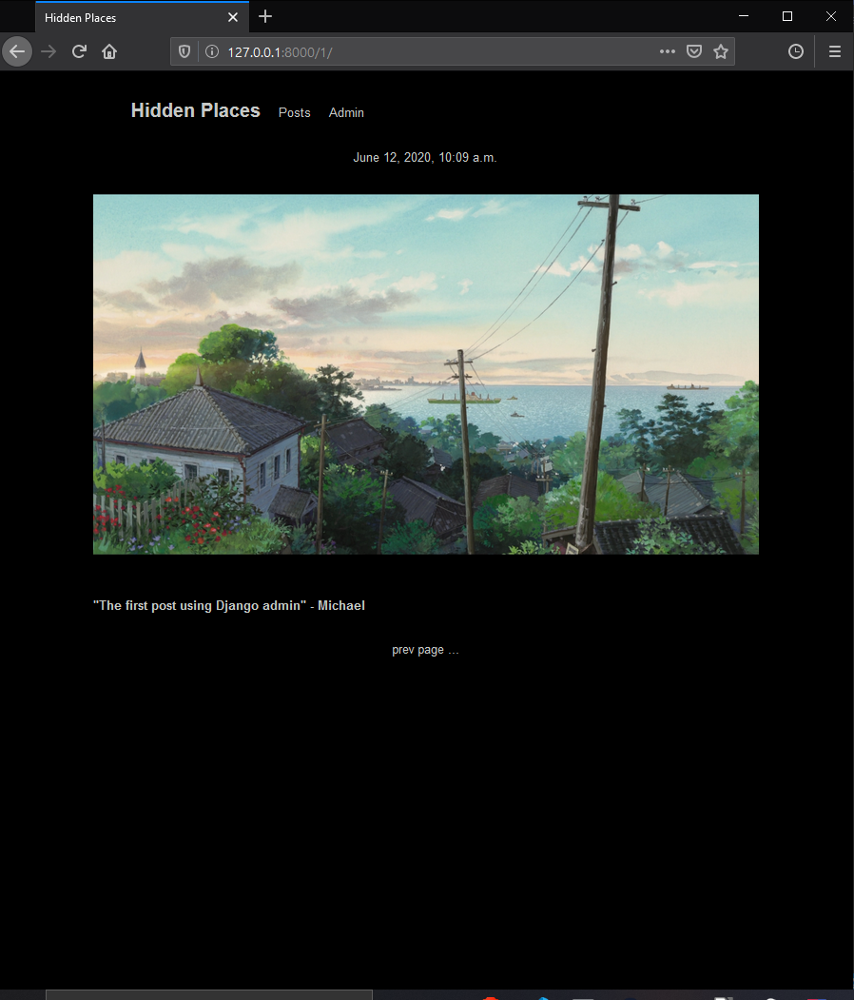

# Django Blog

This project was made so that I could learn more about the Django web framework. While it's written in Python like the Flask micro-framework, it comes with pre-established methods for dealing with program structure (breaking sites up into projects and apps), URLs (the URL dispatcher), data (an ORM defined by models) and many other features such as a pre-built admin site which I used to create, update and delete posts for the preview below.

